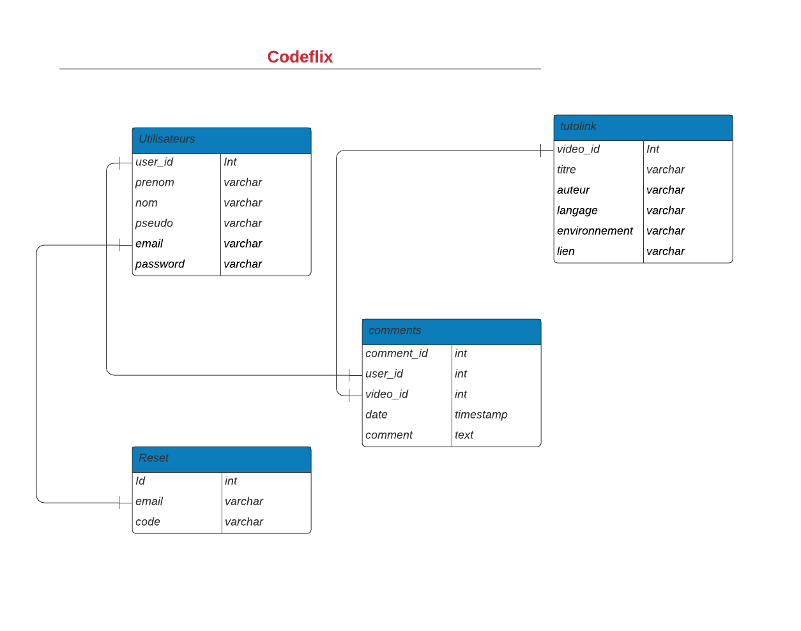

# CodeFlix:

[codeflix](http://www.codefilx.kamilbiczyk.be/)

Codeflix is a project which has been created by a team of four students from BeCode. The goal was to develop a GetFlix website inspired of streaming plateforms like Netflix, Disney ++, Amazon Prime, ... Here are the [instructions](https://github.com/becodeorg/BXL-Swartz-5.34/blob/main/2.The-Hill/1.PHP/GetflixProject.md) we had to follow for this project. 

## Concept:

Our concept was to not to create another movies/TV-shows streaming plateform but to establish something which can be handfull for every junior developper. Codeflix is a plateform dedicated on youtube tutorials about programming languages. All the tutorials will be classed by type of programming languages and the links will be stored into a database.

### How does it work?

Codeflix is composed on several pages: 
- Index page;
- Home page;
- Login page;
- Registration page;
- Forgot password page;
- Profil page;
- Search/result page;
- Pages where you will have the content.

#### Index:
The index is the page where the user lands and gots an overview of what Codeflix offers without having create an account. Then the user has the option to connect or to register herself/hisself. 

#### Registration & login pages:
There are just pages where the user can create an account or log herself/hisself with an existant account and then have access to the home page. 

#### Forgot password page:
This page is accessible on the login page if the user forgot her/his password. By clicking on the link the user arrive on the form where she/he has to write her/his email address. An email will be sended to the user with a link to create a new password.

#### Home page:
Only accessible when the user is logged on. 
This is the main page of the website where all the content is displayed. The tutorials recordings are organized by programmig languages and displayed into cards whith some informations which are inserted into carroussels.
On this page you have access to some filters options, a search bar, the user profil and a link where the user can log out. 

#### Profil page:
This page displays all the informations about the user. There he/she can update the informations which are sended and update into the database.

#### Search/result page:
After having selecting a filter or tipping some keywords into the search bar, the user lands on this page where the results are shown. All the youtube recording are displayed into cards with a button under. 

#### Content pages:
After clicking on the link below the youtube recording on the home page, the user arrives on a page where more informations on the tutorial are shown. Under the recording the user has the option to leave a comment which will be displayed echronological into a second accordion.

### The database: 

The database is established with 4 tables: 

### Programming languages & framework used: 

* HTML 
* CSS
* Bootstrap
* JavaScript
* PHP
* Docker Environnement

---

## Organization:

### The team:

- [Nicolas Biren](https://github.com/birennicolas)
- [Thomas Melchers](https://github.com/thomasmelchers)
- [Marine LLV](https://github.com/MarineLLV)
- [Aurélien Saelens](https://aureliensaelens.github.com)

For this project, we all desired to learn and practice coding with PHP. So we decide to spilt the project into several parts like this everyone can develop her/his knowlegdes of PHP. 

## Methodoly :

1. Organization of roles - One project manager and a working team which works on the front and back-end ;
2. Discussing about the concepts, fonctionnalities; 
3. Creating some draft canvas;
4. Using first the github projects and then Monday to structures the tasks;
5. Repartition of the functionnalities into the team;
6. Compilations of the different parts of the projects;
7. Deployment of the website.

---

## Evaluation criterias

| Criteria       | Indicator                                                    | Yes/No |
| -------------- | ------------------------------------------------------------ | ------ |
| 1. Is complete | The student has realized all must-have features.             |   Yes  |
|                | There is a published GitHub page available.                  |   Yes  |
|                | The code is well indented and commented                      |   Yes  |
|                | The readme is clean and complete                             |   Yes  |
|                | At least one Nice-to-have features is ok                     |   Yes  |
| 2. Is Correct  | The HTML and CSS pass the W3C Validation tool.               |        |
|                | The lighthouse test scores 90 at least on Performance, Best Practices, Accessibility and SEO. |        |

--- 

## Sources : 

* [Youtube](https://youtube.com)
* [Grafikart](https://grafikart.fr)
* [MDN](https://developer.mozilla.org)
* [Stack Overflow](https://stackoverflow.com)
* [W3 Schools](https://w3schools.com)
